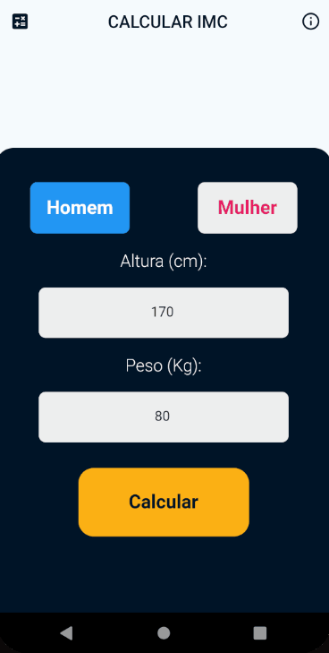

# IMC_CALC

Acativo desenvolvido para cálculo do IMC de modo simples, intuitivo e rápido.

# 🚀 Tecnologias e Programas Utilizados

- 🛠 Flutter

- 🛠 VsCode

- 🛠 Photoshop

Feito por Pedro Henrique - 2021 [Entre em contato!](https://www.linkedin.com/in/pedro-henrique-88a810186/)
